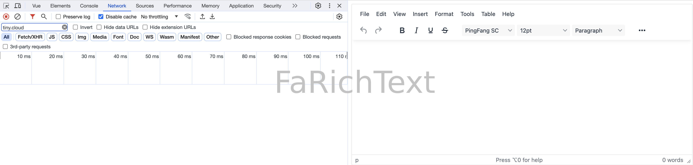

<h1 align="center">
  <a href="https://npmjs.com/package/faim" target="_blank" rel="noopener noreferrer">
    faim <sup></sup>
  </a>
</h1>

<p align="center">
  
  &nbsp;
  
  <br>
  Element Plus (Vue 3) & Element UI (Vue 2.7/2.6) 一体通用 UI 组件库。
  <br>
  ❄️ 不止于 Element。
</p>

<p align="center">
  <a href="https://bundlephobia.com/package/faim"></a>
  <a href="https://conventionalcommits.org"></a>
  <a href="https://github.com/antfu/eslint-config"></a>
  <a href="https://github.com/cloydlau/faim#develop"></a>
</p>

<br>

## 特性

- Vue 2.6/2.7/3 一体通用
- 支持 SSR，Nuxt 2/3 一体通用
- Element UI / Element Plus 一体通用 (定位并不是 Element wrapper，部分组件不依赖 Element 甚至不依赖 Vue，支持任意框架，支持移动端)
- 识别 `el-form` 的 `disabled` 状态
- 支持微前端 ([wujie](https://github.com/Tencent/wujie)，[qiankun](https://github.com/umijs/qiankun)，[single-spa](https://github.com/single-spa/single-spa)...)
- 支持 Vite，Vue CLI，webpack...
- 支持全局属性、全局事件、全局插槽、全局作用域插槽 ([vue-global-config](https://github.com/cloydlau/vue-global-config) 提供技术支持)
- 支持 i18n

<br>

## 安装

```shell
npm i faim
```

> **Note**
>
> 由于需要修改 Element Plus 源码才得以实现 FaImageUpload，故**该组件**存在以下限制：
> - element-plus 不能晚于 faim 安装
>
> - 暂不支持通过 CDN 的方式使用 element-plus

### Bun

允许 faim 执行生命周期脚本：

```json
// package.json
{
  "trustedDependencies": ["faim"]
}
```

### Vite

```ts
// vite.config.ts

export default defineConfig({
  optimizeDeps: {
    include: ['faim > mime', 'faim > qrcode', 'faim > sweetalert2', 'faim > upng-js'],
  },
})
```

### Vue CLI

```js
// vue.config.js

module.exports = {
  transpileDependencies: ['faim'],
}
```

### Element Plus (Vue 3)

#### 局部注册

```vue
<script setup>
import { FaFormDialog, FaImage, FaImageUpload, FaMessageBox, FaPopButton, FaPopSwitch, FaRichText, FaSelect, FaUpload } from 'faim'

// 在 FaRichText 外部引入皮肤、主题、图标等样式资源的目的是方便用户对其进行更换
import 'tinymce/skins/ui/oxide/skin.min.css'
import 'tinymce/themes/silver/theme'
import 'tinymce/icons/default/icons'

const $swal = FaMessageBox
</script>
```

#### 全局注册

```ts
import { createApp, h } from 'vue'
import 'element-plus/dist/index.css'
import ElementPlus from 'element-plus'
import * as ElementPlusIconsVue from '@element-plus/icons-vue'
import { FaFormDialog, FaImage, FaImageUpload, FaMessageBox, FaPopButton, FaPopSwitch, FaRichText, FaSelect, FaUpload } from 'faim'
import App from './App.vue'

// 在 FaRichText 外部引入皮肤、主题、图标等样式资源的目的是方便用户对其进行更换
import 'tinymce/skins/ui/oxide/skin.min.css'
import 'tinymce/themes/silver/theme'
import 'tinymce/icons/default/icons'

const app = createApp(App)
  .use(ElementPlus)
  .use(FaFormDialog, {
    // 全局配置
  })
  .use(FaImage, {
    // 全局配置
  })
  .use(FaImageUpload, {
    // 全局配置
    // 完整示例参考 ./demo/useFaImageUpload
  })
  .use(FaPopButton, {
    // 全局配置
  })
  .use(FaPopSwitch, {
    // 全局配置
  })
  .use(FaRichText, {
    // 全局配置
    // 完整示例参考 ./demo/useFaRichText
  })
  .use(FaSelect, {
    // 全局配置
  })
  .use(FaUpload, {
    // 全局配置
    // 完整示例参考 ./demo/useFaUpload
  })

app.config.globalProperties.$swal = FaMessageBox

for (const [key, component] of Object.entries(ElementPlusIconsVue)) {
  app.component(key, component)
}

app.mount('#app')
```

#### CDN

WIP

### Element UI (Vue 2.7/2.6)

#### 局部注册

```vue
<script>
import { FaFormDialog, FaImage, FaImageUpload, FaMessageBox, FaPopButton, FaPopSwitch, FaRichText, FaSelect, FaUpload } from 'faim'

// 在 FaRichText 外部引入皮肤、主题、图标等样式资源的目的是方便用户对其进行更换
import 'tinymce/skins/ui/oxide/skin.min.css'
import 'tinymce/themes/silver/theme'
import 'tinymce/icons/default/icons'

const $swal = FaMessageBox

export default {
  components: { FaFormDialog, FaImage, FaImageUpload, FaPopButton, FaPopSwitch, FaRichText, FaSelect, FaUpload },
}
</script>
```

#### 全局注册

```ts
import Vue from 'vue'
import 'element-ui/lib/theme-chalk/index.css'
import ElementUI from 'element-ui'
import { FaFormDialog, FaImage, FaImageUpload, FaMessageBox, FaPopButton, FaPopSwitch, FaRichText, FaSelect, FaUpload } from 'faim'
import App from './App.vue'

// 在 FaRichText 外部引入皮肤、主题、图标等样式资源的目的是方便用户对其进行更换
import 'tinymce/skins/ui/oxide/skin.min.css'
import 'tinymce/themes/silver/theme'
import 'tinymce/icons/default/icons'

Vue.use(ElementUI)
Vue.use(FaFormDialog, {
  // 全局配置
})
Vue.use(FaImage, {
  // 全局配置
})
Vue.use(FaImageUpload, {
  // 全局配置
  // 完整示例参考 ./demo/useFaImageUpload
})
Vue.use(FaPopButton, {
  // 全局配置
})
Vue.use(FaPopSwitch, {
  // 全局配置
})
Vue.use(FaRichText, {
  // 全局配置
  // 完整示例参考 ./demo/useFaRichText
})
Vue.use(FaSelect, {
  // 全局配置
})
Vue.use(FaUpload, {
  // 全局配置
  // 完整示例参考 ./demo/useFaUpload
})

Object.defineProperty(Vue.prototype, '$swal', {
  value: FaMessageBox,
})

new Vue({
  render: h => h(App),
}).$mount('#app')
```

#### CDN

WIP

### 非 Element 环境

以下组件支持在非 Element 环境中使用：

- FaImage
- FaMessageBox
- FaRichText
- FaUpload

### 非 Vue 环境

以下组件支持在非 Vue 环境中使用：

- FaMessageBox

### 覆盖依赖版本

```json
// package.json
{
  // npm/cnpm/bun
  "overrides": {
    "xxx": "xxx"
  },
  // yarn/bun
  "resolutions": {
    "faim/xxx": "xxx"
  },
  // pnpm
  "pnpm": {
    "overrides": {
      "xxx": "xxx"
    }
  }
}
```

<br>

## FaFormDialog

[el-dialog](https://element.eleme.cn/#/zh-CN/component/dialog) + [el-form](https://element.eleme.cn/#/zh-CN/component/form) 组合拳。

### 特性

- 打开对话框自动回显数据，关闭对话框自动重置数据
- 提交、拒绝、重置、全屏一应俱全
- 校验失败时平滑滚动至错误项并震动提示
- 限制高度，无页面级滚动条
- 只读模式

### Props

| 名称                                               | 说明                                | 类型                   | 默认值                         |
|----------------------------------------------------|-------------------------------------|------------------------|--------------------------------|
| title                                              | 对话框标题                          | string                 |                                |
| v-model:show (Vue 3) /<br>show.sync (Vue 2)        | 是否显示                            | boolean                | `false`                        |
| modelValue (Vue 3) /<br>value (Vue 2) /<br>v-model | 表单数据对象 (`el-form` 的 `model`) | any                    |                                |
| elFormProps                                        | `el-form` 的属性                    | object                 |                                |
| retrieve                                           | 读取数据                            | Function               |                                |
| retrieving                                         | 读取状态                            | boolean                | `false`                        |
| readonly                                           | 是否只读                            | boolean                | `false`                        |
| showFullscreenToggle                               | 是否显示全屏开关                    | boolean                | `true`                         |
| showConfirmButton                                  | 是否显示确认按钮                    | boolean                | `!readonly`                    |
| confirm                                            | 确认                                | Function               |                                |
| showCancelButton                                   | 是否显示取消按钮                    | boolean                | `!readonly`                    |
| showDenyButton                                     | 是否显示拒绝按钮                    | boolean                | `false`                        |
| deny                                               | 拒绝                                | Function               |                                |
| showResetButton                                    | 是否显示重置按钮                    | boolean                | `false`                        |
| reset                                              | 重置                                | Function               |                                |
| reverseButtons                                     | 是否反转按钮顺序                    | boolean                | `false`                        |
| locale                                             | i18n                                | Record<string, string> | [查看代码](./src/locale/en.ts) |
| ...                                                | `el-dialog` 的属性                  |                        |                                |

#### modelValue (Vue 3) / value (Vue 2) / v-model

如果是 plain object 类型，将用于 `el-form` 的 `model`。

`onMounted` 时记录初始值 (与 `el-form-item` 保持一致)，关闭对话框时会重置至初始值。

#### retrieve

```vue
<template>
  <FaFormDialog
    :retrieve="() => {
      // 表格打开之后、获取数据之前
      return $POST('xxx').then(() => {
        // 获取数据之后
      })
    }"
  />
</template>
```

#### readonly

开启只读模式时默认不显示确认和取消按钮。

跟 `<el-form disabled />` 的区别是在样式上，更便于用户阅读。

如果希望部分组件不进入禁用状态：

- 单独给这个组件设置 `:disabled="false"`
- 给这部分组件包一层 `<el-form />`

#### confirm

如果返回一个 Promise 实例，则在该 Promise 实例状态终结后对话框才会关闭。

```vue
<template>
  <FaFormDialog
    :confirm="() => {
      // 确认之前
      return $POST('xxx').then(() => {
        // 确认之后
      })
    }"
  />
</template>
```

返回 `Promise.reject()` / `Promise.resolve({ show: true })` / `{ show: true }` 时对话框不会关闭。

```vue
<template>
  <FaFormDialog
    :confirm="() => {
      const valid = true
      if (valid) {
        return $POST('xxx')
      }
      else {
        $swal.warning('校验失败')
        return {
          show: true,
        }
      }
    }"
  />
</template>
```

#### deny

如果返回一个 Promise 实例，则在该 Promise 实例状态终结后对话框才会关闭。

```vue
<template>
  <FaFormDialog
    :deny="() => {
      // 拒绝之前
      return $POST('xxx').then(() => {
        // 拒绝之后
      })
    }"
  />
</template>
```

返回 `Promise.reject()` / `Promise.resolve({ show: true })` / `{ show: true }` 时对话框不会关闭。

```vue
<template>
  <FaFormDialog
    :deny="() => {
      const valid = true
      if (valid) {
        return $POST('xxx')
      }
      else {
        $swal.warning('校验失败')
        return {
          show: true,
        }
      }
    }"
  />
</template>
```

#### reverseButtons

关于 “确定” 和 “取消” 按钮的顺序，可以看看这篇[知乎回答](https://www.zhihu.com/question/20694680/answer/1400624833)。

### Events

| 名称              | 说明                         | 回调参数              |
|-------------------|----------------------------|-----------------------|
| fullscreen-change | 切换全屏状态时触发           | (fullscreen: boolean) |
| ...               | `el-dialog`、`el-form` 的事件 |                       |

### Slots

| 名称    | 说明               |
|---------|------------------|
| default | `el-form` 的内容   |
| ...     | `el-dialog` 的插槽 |

### Exposes

| 名称           | 说明                           | 类型                                                                                                       |
|----------------|------------------------------|------------------------------------------------------------------------------------------------------------|
| highlightError | 平滑滚动至校验失败的表单项     | (selectors: string \| Element \| NodeList = '.el-form .el-form-item.is-error', container = window) => void |
| ...            | 通过 ref 调用 `el-form` 的方法 |                                                                                                            |

### 改变遮罩层定位

```scss
.el-dialog__wrapper, .v-modal {
  position: absolute;
}

// 在原来的基础上减去 navbar + tab 的高度 (以 90px 为例)
.el-dialog {
  .el-dialog__body {
    max-height: calc(100vh - 190px) !important;
  }

  &.is-fullscreen .el-dialog__body {
    max-height: calc(100vh - 135px) !important;
  }
}
```

<br>

## FaImage

[Viewer.js](https://github.com/fengyuanchen/viewerjs) + [Swiper](https://swiperjs.com) + [node-qrcode](https://github.com/soldair/node-qrcode) 组合拳。

### 特性

- 不依赖 Element，支持任意 UI 框架
- 多样的展示形式：文档流/瀑布流/轮播图/表格嵌套，适配 `<table>` & `<el-table>`
- 灵活的数据类型：URL/Base64/二维码/[object URL](https://developer.mozilla.org/en-US/docs/Web/API/File_API/Using_files_from_web_applications#example_using_object_urls_to_display_images)
- 任意绑定值类型

### Props

| 名称                                  | 说明                                                  | 类型                                  | 默认值                                                              |
|---------------------------------------|-----------------------------------------------------|---------------------------------------|---------------------------------------------------------------------|
| modelValue (Vue 3) /<br>value (Vue 2) | 绑定值                                                | any                                   |                                                                     |
| pattern                               | 展示模式（`'waterfall'`, `'swiper'` 或 `'table-cell'`） | string                                | `undefined`（即文档流）                                               |
| srcAt                                 | 图片 `src` 的位置                                     | string / symbol / (value: any) => any |                                                                     |
| viewable                              | 是否启用 Viewer.js                                    | boolean                               | `true`                                                              |
| viewerOptions                         | Viewer.js 的参数                                      | object                                | `{ zIndex: 5000, zoomRatio: 0.4 }`                                  |
| swiperOptions                         | Swiper 的参数                                         | object                                | `{ observer: true }`                                                |
| qrcode                                | 是否将 `value` 转换为二维码                           | boolean / `'auto'`                    | `false`                                                             |
| qrcodeOptions                         | node-qrcode 的参数                                    | object                                | `{ margin: 0, errorCorrectionLevel: 'L', width: 444, height: 444 }` |

#### qrcode

如果将 `qrcode` 设为 `'auto'`，FaImage 会自动判断是否需要转换 (`value` 为 Base64 或 URL 时不会转换)。

#### srcAt

用于定位 `value` 中的图片 `src`，适用于绑定值非 `src` 本身的情况。

- 支持属性名，如 `'url'`
- 支持属性路径，如 `'data[0].url'`
- 支持 symbol 类型的属性名
- 支持 Function，如 `({ url }) => url`

### Slots

| 名称    | 说明           |
|---------|--------------|
| default | 自定义图片标签 |

### Exposes

| 名称   | 说明           | 类型   |
|--------|--------------|--------|
| viewer | Viewer.js 实例 | Object |
| swiper | Swiper 实例    | Object |

```html
<FaImage>
  <template #default="{ src, index }">
    
    <div>第{{ index + 1 }}张</div>
  </template>
</FaImage>
```

通过默认插槽来使用 `el-image`：

```html
<FaImage>
  <template #default="{ src, index }">
    <el-image :src="src" />
    <div>第{{ index + 1 }}张</div>
  </template>
</FaImage>
```

### 获取 Swiper 实例

```vue
<script setup>
import FaImage from 'fa-image'

const faImageRef = ref()
</script>

<template>
  <FaImage
    ref="faImageRef"
    pattern="swiper"
    :swiperOptions="{
      on: {
        init: () => {
          $nextTick(() => {
            console.log(faImageRef.swiper)
          })
        },
      },
    }"
  />
</template>
```

### 二维码清晰度

默认的图片 CSS 高度为 148px (与 `el-upload` 保持一致)，默认的二维码分辨率为 444 × 444 (三倍图)，如果你增大了图片的 CSS 尺寸，将导致图片变模糊。

解决方式：将二维码分辨率设置为展示尺寸的三倍。

```vue
<template>
  <FaImage
    :qrcodeOptions="{
      width: 900,
      height: 900,
    }"
  />
</template>

<style lang="scss" scoped>
// Vue 2.6 需要将 :deep 替换为 ::v-deep
:deep(.fa-image) img {
  width: 300px;
  height: 300px;
}
</style>
```

<br>

## FaImageUpload

`el-upload` 封装，图片上传一站式解决方案。

### 对比 FaUpload

- FaImageUpload 专攻图片上传，支持图片编辑
- FaImageUpload 支持图片回显，不存在跨域问题
- FaImageUpload 依赖 Element

### 特性

- 数据双向绑定 `v-model`，支持任意绑定值类型
- 数据源
  - 用户选择本地文件 (File)
  - 编程式提供数据源 (File/Blob/Base64/URL/[object URL](https://developer.mozilla.org/en-US/docs/Web/API/File_API/Using_files_from_web_applications#example_using_object_urls_to_display_images))
- 编辑图片
  - 格式转换
  - 尺寸指定
  - 品质调节
  - 自由裁剪 & 锁定比例裁剪
  - 翻转、缩放、无级角度旋转
- 限制图片
  - 格式筛选，扩展名校验 (防篡改)
  - 尺寸或尺寸范围 (间接限制宽高比例)
  - 分辨率或分辨率范围
  - 体积上限、下限
  - 数量上限、下限
  - 自定义校验
  - 限制条件可视化 (让用户根据限制条件去准备图片，而不是准备好了才发现不合适)
- 多选、并发上传
- 拖拉拽上传、拖拉拽排序
- 使用 FaImage 来预览图片
- 支持表格嵌套，适配 `<table>` & `<el-table>`

### Props

| 名称                                               | 说明                             | 类型                                                                            | 默认值                         |
|----------------------------------------------------|----------------------------------|---------------------------------------------------------------------------------|--------------------------------|
| modelValue (Vue 3) /<br>value (Vue 2) /<br>v-model | 绑定值                           | any                                                                             |                                |
| upload                                             | 调用接口上传图片，返回图片 URL/ID | (output: File \| Blob) => Promise<string \| object> \| string \| object \| void |                                |
| arrayed                                            | 绑定值是否为数组类型，默认自动    | boolean                                                                         |                                |
| srcAt                                              | 图片 URL/ID 的位置               | string / symbol / (value: any) => any                                           |                                |
| disabled                                           | 禁用状态                         | boolean                                                                         | `false`                        |
| editable                                           | 是否开启编辑功能                 | boolean                                                                         | `true`                         |
| extensions                                         | 文件扩展名                       | string                                                                          |                                |
| size                                               | 体积限制 (MB)                    | number / [number?, number?]                                                     |                                |
| count                                              | 数量限制                         | number / [number?, number?]                                                     |                                |
| width                                              | 宽度或宽度范围 (像素)            | number / [number?, number?]                                                     |                                |
| height                                             | 高度或高度范围 (像素)            | number / [number?, number?]                                                     |                                |
| aspectRatioTolerance                               | 锁定裁剪比例的公差               | number                                                                          | `0`                            |
| resolution                                         | 分辨率或分辨率范围 (像素)        | number / [number?, number?]                                                     |                                |
| validator                                          | 自定义数据源校验器               | (source: File \| Blob \| string) => boolean                                     |                                |
| outputType                                         | 图片输出格式 (编辑后)，默认原格式 | string                                                                          |                                |
| locale                                             | i18n                             | Record<string, string>                                                          | [查看代码](./src/locale/en.ts) |
| ...                                                | `el-upload` 的属性               |                                                                                 |                                |

#### upload

开启编辑功能时，会在编辑完成后调用，未开启编辑功能时，会在选择图片后调用

未配置或函数返回值为空时，绑定值将输出二进制文件

参数为编辑产物：

用户选择本地文件、编程式提供 File 类型的数据源时，编辑产物的类型为 File

编程式提供非 File 类型的数据源且编辑了图片时，编辑产物的类型为 Blob

未开启编辑功能或未编辑时，编辑产物即输入值

编程式提供 string 类型的数据源且未编辑时，不需要上传，该方法不会被调用

返回值类型为 Promise\<object\> 或 object 时需要配置 srcAt

#### arrayed

如果数量上限和图片数量均不超过 1，则处于单选状态，否则为多选

默认情况下，在单选时输出的绑定值形如：item，多选时输出的绑定值形如：[item，item]

item 具体是什么格式？

未配置 srcAt 时，会提取图片 URL/ID 作为 item，配置了则不会

如果将 arrayed 设置为 `true` 则强制输出数组类型，无论单选还是多选

如果将 arrayed 设置为 `false` 则强制输出非数组类型，如果此时图片数量为多个，则会执行 `JSON.stringify`

#### srcAt

用于定位 value 和 upload 返回值中的图片 URL/ID，适用于绑定值非图片 URL/ID 本身的情况

- 支持属性名，如 `'url'`
- 支持属性路径，如 `'data[0].url'`
- 支持 symbol 类型的属性名
- 支持 Function，如 `value => value.url`

#### extensions

对比 accept：

- 可选值不同：accept 接受扩展名、MIME 和两者的混合，详见 <https://developer.mozilla.org/en-US/docs/Web/HTML/Element/input/file#unique_file_type_specifiers>，extensions 只接受扩展名
- 功能不同：accept 仅在用户选择文件时做一个默认的格式筛选，但这个筛选是可以修改的，用户仍然可以选择其他类型的文件，extensions 除了格式筛选，还做扩展名校验，一是防止用户选择其它类型的文件，二是防止用户篡改扩展名

#### size

- `1`：限制体积上限为 1M
- `[0.125]`：限制体积下限为 128K
- `[, 1]`：限制体积上限为 1M
- `[0.125, 1]`：限制体积下限为 128K，且上限为 1M

#### count

- `10`：限制数量上限为 3 张
- `[1]`：限制数量下限为 1 张
- `[, 10]`：限制数量上限为 3 张
- `[1, 10]`：限制数量下限为 1 张，且上限为 3 张

#### width

- `500`：限制宽度为 500 像素
- `[100]`：限制宽度下限为 100 像素
- `[, 1000]`：限制宽度上限为 1000 像素
- `[100, 1000]`：限制宽度下限 100 像素，且上限为 1000 像素

#### height

- `500`：限制高度为 500 像素
- `[100]`：限制高度下限为 100 像素
- `[, 1000]`：限制高度上限为 1000 像素
- `[100, 1000]`：限制高度下限 100 像素，且上限为 1000 像素

#### resolution

即宽高乘积

- `250000`：限制分辨率为 250000 像素
- `[10000]`：限制分辨率下限为 10000 像素
- `[, 1000000]`：限制分辨率上限为 1000000 像素
- `[10000, 1000000]`：限制分辨率下限 10000 像素，且上限为 1000000 像素

#### outputType

开启编辑模式时，可以指定输出的图片格式，可选值参考 [MIME type](https://www.iana.org/assignments/media-types/media-types.xhtml#image)

### Slots

同 `el-upload`

### Exposes

| 名称       | 说明                             | 参数                                                                     |
|------------|--------------------------------|--------------------------------------------------------------------------|
| openEditor | 打开图片编辑对话框               | (source: File \| Blob \| string \| File[] \| Blob[] \| string[]) => void |
| uploading  | 图片上传状态                     | boolean                                                                  |
| ...        | 通过 ref 调用 `el-upload` 的方法 |                                                                          |

openEditor 参数为输入的数据源，支持的数据类型有：

- File
- Blob
- Base64
- URL：需要跨域支持
- object URL：需要在当前 `document` 创建

如果没有编辑图片，则输出值类型不变 (与输入值一致)

如果编辑了图片，输入类型为 File 时，输出类型也为 File，其它情况均输出 Blob 类型

如果未开启编辑模式，且限制了图片体积/宽高/分辨率，则需要 `await openEditor(...)`

### 编程式提供数据源

```vue
<template>
  <!-- eslint-disable vue/no-constant-condition -->
  <FaImageUpload
    v-show="false"
    ref="faImageUploadRef"
    :upload="(file) => $POST.upload(import.meta.env.VITE_APP_UPLOAD_API, {
      file,
    }).then(res => res.data.data)"
  />

  <el-button
    @click="async () => {
      const url = 'https://picsum.photos/100'
      const fileName = '100x100.jpg'
      // 如果需要附加图片名称，可以先转换为 File 类型再输入
      const blob = await (await fetch(url)).blob()
      const file = new File([blob], fileName, { type: blob.type })
      await $refs.faImageUploadRef.openEditor(file)
    }"
  >
    编辑图片
  </el-button>
</template>
```

### 输出体积

图片经过编辑后，输出的体积与以下因素相关：

- 原图体积
- 配置或用户设置的图片宽度
- 配置或用户设置的图片高度
- 配置的图片格式
- 用户设置的品质系数

### 自定义 trigger

```vue
<template>
  <FaImageUpload
    class="fa-image-upload__custom-trigger"
    list-type="text"
  >
    <el-button>自定义 trigger</el-button>
  </FaImageUpload>
</template>

<style lang="scss" scoped>
// Vue 2.6 需要将 :deep() 替换为 ::v-deep
:deep(.fa-image-upload__custom-trigger) {
  .fa-image,
  .el-upload-list,
  .el-upload__tip,
  .el-upload__text {
    display: none;
  }
  .el-upload-dragger {
    width: unset;
    height: unset;
    margin-bottom: 8px;
  }
}
</style>
```

<br>

## FaMessageBox

<a href="https://sweetalert2.github.io">sweetalert2</a> + `ElMessageBox` 组合拳。

### 特性

- 不依赖 Element，支持任意 UI 框架
- 不依赖 Vue，支持非 Vue 环境

### 生命周期

```ts
FaMessageBox.success('Operation Success').then(() => {
  // onClose
})

FaMessageBox.info('Information').then(() => {
  // onClose
})

FaMessageBox.warning('Warning').then(() => {
  // onClose
})

FaMessageBox.error('Error Occurred').then(() => {
  // onClose
})

FaMessageBox.confirm('Are You Sure?').then(() => {
  // onConfirmed
}).catch((e) => {
  if (e.isDenied) {
    // onDenied
  } else if (e.isDismissed) {
    // onDismissed
  }
})

FaMessageBox.loading().then(() => {
  // onClose
})
FaMessageBox.close()
```

### 案例：强制确认

无取消，必须确认

```ts
FaMessageBox.confirm({
  titleText: 'Confirm to continue',
  showCancelButton: false,
  allowOutsideClick: false,
  allowEscapeKey: false,
})
```

### 案例：复杂确认

```ts
// form with async submitting
FaMessageBox.confirm({
  input: 'text',
  inputAttributes: {
    placeholder: 'Remark'
  },
  confirmButtonText: 'Agree',
  showLoaderOnConfirm: true,
  preConfirm: (input) => {
    return new Promise((resolve) => {
      setTimeout(resolve, 500)
    }).then(() => {
      alert('Agree Success')
    }).catch((e) => {
      alert('Agree Failed')
    })
  },
  showDenyButton: true,
  denyButtonText: 'Deny',
  returnInputValueOnDeny: true,
  preDeny: (input) => {
    if (input) {
      return new Promise((resolve, reject) => {
        setTimeout(reject, 500)
      }).then(() => {
        alert('Deny Success')
      }).catch((e) => {
        alert('Deny Failed')
      })
    } else {
      FaMessageBox.showValidationMessage('Please fill in the remark')
      return false
    }
  },
}).then((e) => {
  alert('Agreed')
}).catch((e) => {
  if (e.isDenied) {
    alert('Denied')
  } else if (e.isDismissed) {
    alert('Dismissed')
  }
})
```

### 在非 Vue 环境中使用

```ts
import FaMessageBox from 'faim/dist/components/MessageBox/index'
```

<br>

## FaPopButton

`el-button` + `el-popconfirm` + `el-popover` + `el-tooltip` 组合拳。

### 特性

- 操作拦截 (`el-popconfirm` 点击确定后才会触发 `click` 事件)
- `el-popover` 和 `el-tooltip` 的 `content` 属性均支持渲染 HTML
- `el-tooltip` 不与 `el-popconfirm`、`el-popover` 冲突
- `el-popconfirm`、`el-popover`、`el-tooltip` 内容为空时，默认不启用

### Props

| 名称                        | 说明                                       | 类型    | 默认值  |
|-----------------------------|------------------------------------------|---------|---------|
| elPopconfirmProps           | `el-popconfirm` 的属性                     | object  |         |
| elPopoverProps              | `el-popover` 的属性，支持事件绑定           | object  |         |
| `elPopoverProps.rawContent` | `content` 中的内容是否作为 HTML 字符串处理 | boolean | `false` |
| elTooltipProps              | `el-tooltip` 的属性                        | object  |         |
| `elTooltipProps.rawContent` | `content` 中的内容是否作为 HTML 字符串处理 | boolean | `false` |
| ...                         | `el-button` 的属性                         |         |         |

### Events

`el-popconfirm`、`el-popover` 的事件。

### Slots

| 名称            | 说明                           |
|-----------------|------------------------------|
| tooltip-content | `el-tooltip` 的 `content` 插槽 |
| popover-content | `el-popover` 的 `content` 插槽 |

<br>

## FaPopSwitch

`el-switch` + `el-popconfirm` + `el-popover` + `el-tooltip` 组合拳。

### 特性

- 操作拦截 (`el-popconfirm` 点击确定后才会触发 `change` 事件)
- 支持内嵌文字描述，宽度自适应
- `el-popover` 和 `el-tooltip` 的 `content` 属性均支持渲染 HTML
- `el-tooltip` 不与 `el-popconfirm`、`el-popover` 冲突
- `el-popconfirm`、`el-popover`、`el-tooltip` 内容为空时，默认不启用

### Props

| 名称                        | 说明                                       | 类型    | 默认值  |
|-----------------------------|------------------------------------------|---------|---------|
| inlinePrompt                | 是否内嵌文字描述                           | boolean | `false` |
| elPopconfirmProps           | `el-popconfirm` 的属性                     | object  |         |
| elPopoverProps              | `el-popover` 的属性，支持事件绑定           | object  |         |
| `elPopoverProps.rawContent` | `content` 中的内容是否作为 HTML 字符串处理 | boolean | `false` |
| elTooltipProps              | `el-tooltip` 的属性                        | object  |         |
| `elTooltipProps.rawContent` | `content` 中的内容是否作为 HTML 字符串处理 | boolean | `false` |
| ...                         | `el-switch` 的属性                         |         |         |

### Events

`el-switch`、`el-popconfirm`、`el-popover` 的事件。

### Slots

| 名称            | 说明                           |
|-----------------|------------------------------|
| tooltip-content | `el-tooltip` 的 `content` 插槽 |
| popover-content | `el-popover` 的 `content` 插槽 |

### Exposes

通过 ref 调用 `el-switch` 的方法。

<br>

## FaRichText

富文本编辑器，可离线使用的 <a href="https://github.com/tinymce/tinymce">TinyMCE</a> Vue 封装。

### 对比 [tinymce-vue](https://github.com/tinymce/tinymce-vue)

- tinymce-vue 需要加载至少 **380kB** 的网络资源 (开启插件全家桶将达到 **563kB**，还没算上付费插件)，外网会很慢，甚至超时
- tinymce-vue 有[域名检测](#域名检测)，会弹窗警告
- tinymce-vue 区别适配不同的 Vue 版本，升级成本较高，针对 Vue 2 的 v3 版本最后更时间为 2021-01，有停止维护风险
- tinymce-vue 默认功能最小化，需要繁杂的配置，还不支持全局传参




### 特性

- 可离线使用，零网络延迟
- 无[域名检测](#域名检测)，无弹窗困扰
- 插件全家桶开箱即用
- 提供常用自定义插件示例
  - 插入本地图片
  - 插入本地视频
  - 插入本地音频
  - 插入 Word 文档 (`.docx`)，兼容 Microsoft Office、WPS
- 支持浅色模式 & 深色模式，主题、图标、内容样式均可自定义
- 支持将 HTML 输出为普通文本

### Props

| 名称                                                | 说明                                                   | 类型    | 默认值                                         |
|-----------------------------------------------------|------------------------------------------------------|---------|------------------------------------------------|
| modelValue (Vue 3) /<br>value (Vue 2) /<br> v-model | 绑定值                                                 | string  |                                                |
| disabled                                            | 禁用状态                                               | boolean | `false`                                        |
| outputFormat                                        | 输出格式，`'html'` 或 `'text'`                          | string  | `'html'`                                       |
| ...                                                 | [TinyMCE 配置](https://www.tiny.cloud/docs/tinymce/6/) | /       | [查看代码](./src/components/RichText/index.ts) |

<br>

### Exposes

| 名称 | 说明    | 类型   |
|------|-------|--------|
| id   | 元素 ID | string |

<br>

### 获取 [TinyMCE Editor](https://www.tiny.cloud/docs/tinymce/6/apis/tinymce.editor/) 实例

```vue
<!-- 示例: 监听 TinyMCE 的事件 -->

<script setup>
import { reactive, ref } from 'vue'
import tinymce from 'tinymce/tinymce'

const faRichTextRef = ref()
</script>

<template>
  <FaRichText
    ref="faRichTextRef"
    :setup="(editor) => {
      // 方式1
      editor.on('init', (e) => {
        console.log('init', e)

        // 方式2
        tinymce.get(faRichTextRef.value.id).on('Change', (e) => {
          console.log('Change', e)
        })

        // 方式3
        tinymce.activeEditor.on('Change', (e) => {
          console.log('Change', e)
        })
      })
    }"
    :init_instance_callback="(editor) => {
      // 方式4
      editor.on('Change', (e) => {
        console.log('Change', e)
      })
    }"
  />
</template>
```

### 显隐控制

请使用 `v-if` 控制显隐。

由于实际的富文本元素并没有挂载在 `selector` 上面，所以使用 `v-show` 切换显隐会有问题。

### 内容样式

富文本的内容样式建议在展示侧自行添加，而不是在富文本的生产侧添加，因为：

1. 富文本的生产侧无法满足展示侧各自的定制化需求
2. 展示侧可能包含小程序，小程序不支持 `style` 标签

<a name="域名检测"></a>

### 域名检测

TinyMCE 有四种价格计划：

- Core (免费)
- Essential
- Professional
- Flexible

如果没有注册 Tiny 账号、或者没有在账号设置中登记域名，界面上会有警告弹出 (**即使你使用的是免费的 Core 计划**)

> 当然，你可以用 CSS 来屏蔽弹窗，只是不推荐这种方式

TinyMCE 提供了两种加载方式：

- CDN (tinymce-vue 采用的方式)：需要注册账号以提供 `api-key`，并在账号设置中登记所有用到 TinyMCE 的项目域名
- NPM (FaRichText 采用的方式)：没有 `api-key` 参数，所以不需要注册账号、不需要登记域名，参考 [Tiny 官方解释](https://stackoverflow.com/questions/63398432/how-to-use-tinymce-5-api-key-using-npm)

### 自定义插件示例

[插入本地图片/视频/音频](./demo/useFaRichText/plugins/InsertFile)

[插入 Word 文档 (`.docx`)，兼容 Microsoft Office、WPS](./demo/useFaRichText/plugins/InsertWord)

#### 粘贴 Word 文档

TinyMCE 提供了 premium 插件 PowerPaste，可用于粘贴 Word 文档，但兼容性一般，尤其是不支持 WPS

FaRichText 提供了插入 Word 文档的插件示例，兼容 Microsoft Office、WPS，可在一定程度上替代 PowerPaste

注意：粘贴可以片段粘贴，插入只能整个文档插入

#### PowerPaste 插件

```ts
// PowerPaste 配置示例

import { FaRichText } from 'faim'
import axios from 'axios'
import createAxiosShortcut from 'axios-shortcut'

const { POST } = createAxiosShortcut(axios)

app.use(FaRichText, {
  images_upload_handler(blobInfo, success, failure) {
    const blob = blobInfo.blob()
    const file = new File(
      [blob],
      blobInfo.filename(),
      { type: blob.type }
    )

    POST.upload(process.env.VUE_APP_UPLOAD_API, {
      file
    }).then((res) => {
      if (typeof res.data?.data === 'string') {
        success(res.data.data)
      } else {
        failure(res.data?.message)
      }

    }).catch((err) => {
      failure(String(err))
    })
  },
})
```

- 兼容性
  

- 受浏览器限制，PowerPaste 插件**无法支持微软 Word 和 Excel 文档所支持的<font color="#dd0000">所有</font>图片类型**
  。举个例子，浏览器禁止以编程方式访问文件系统，所以无法解析文档中使用 `file://` 协议的图片 (WPS 使用的就是此协议)。

- 粘贴微软 Word 文档 (Windows 系统、≥ 2013 版本) 中<font color="#dd0000">受保护视图</font>的内容，将仅得到**无格式的普通文本**，这是受保护视图与剪贴板的交互机制决定的。

- 受微软 Excel 网页版限制，粘贴<font color="#dd0000">微软 Excel 网页版</font>的内容将仅得到**无格式的普通文本**。

### 粘贴网页内容 (HTML)

#### 格式

粘贴的网页内容默认会保留一定的源格式，启用 PowerPaste
插件后，对格式的处理将会更加完善。详见 [Improved HTML Cleaning](https://www.tiny.cloud/docs/tinymce/6/powerpaste-support/#improved-html-cleaning)

如需获取纯文本，选中**编辑**-**粘贴为文本**再进行粘贴

**清除格式**按钮得到的<font color="#dd0000">不是</font>纯文本，可以自定义清除效果：
[Removing a format](https://www.tiny.cloud/docs/tinymce/6/content-formatting/#removing-a-format)

#### 图片

如果用户复制第三方网站的内容到编辑框内，静态资源 (如图片) 可能无法正常显示，这是因为：

1. 第三方网站没有开启静态资源的跨域访问

2. 第三方网站对静态资源做了 Referer 校验

TinyMCE 的 `urlconverter_callback`、`paste_postprocess` API 不支持异步操作，所以批量转存图片可行性低

技术上是可以解决的，可以通过 NGINX 动态代理配合这两个 API 来处理

请自行评估相关风险

<br>

## FaSelect

`el-select` + `el-option` + `el-option-group` 组合拳。

### 特性

- 单向绑定 `label`
- 远程搜索时无需关心 `options` 和 `loading`
- 无匹配选项时展示 `label` (而不是 `value`)
- 多选时支持一键全选

### Props

| 名称                                               | 说明                              | 类型                                          | 默认值                         |
|----------------------------------------------------|-----------------------------------|-----------------------------------------------|--------------------------------|
| modelValue (Vue 3) /<br>value (Vue 2) /<br>v-model | 绑定值                            | any                                           |                                |
| v-model:options (Vue 3) /<br>options.sync (Vue 2)  | 选项                              | any[]                                         |                                |
| v-model:label (Vue 3) /<br>label.sync (Vue 2)      | 绑定值对应的 `label` (单向数据流) | string \| string[]                            |                                |
| props                                              | 定位选项的各项属性                | object                                        |                                |
| search                                             | 远程搜索 (`remote-method` 封装)   | (query: string) =><br>Promise<any[]> \| any[] |                                |
| searchImmediately                                  | 是否立即执行远程搜索              | boolean                                       | `true`                         |
| showSelectAllCheckbox                              | 多选时是否显示全选框              | boolean                                       | `true`                         |
| locale                                             | i18n                              | Record<string, string>                        | [查看代码](./src/locale/en.ts) |
| ...                                                | `el-select` 的属性                |                                               |                                |

#### options

默认情况下绑定值将得到选中项的数组元素本身。

可使用 `props.value` 改变此行为 (比如选项的数组元素是 plain object 类型，而绑定值只想要其中某个属性)。

#### props

```ts
interface Props {
  // 定位 option 中的 value
  // 如果是 string 类型，将默认用于 el-select 的 value-key
  'value': string | symbol | ((value: any) => any)
  // 定位 option 中的 label
  'label': string | symbol | ((value: any) => string)
  // 定位 option 中的 disabled
  'disabled': string | symbol | ((value: any) => boolean)
  // 定位 option 中分组的 label
  'groupLabel': string | symbol | ((value: any) => string)
  // 定位 option 中分组的 options
  'groupOptions': string | symbol | ((value: any) => any[])
  // 定位 option 中分组的 disabled
  'groupDisabled': string | symbol | ((value: any) => boolean)
}
```

- 支持属性名，如 `'url'`
- 支持属性路径，如 `'data[0].url'`
- 支持 symbol 类型的属性名
- 支持 Function，如 `value => value.url`

### Events

`el-select` 的事件。

### Slots

| 名称           | 说明                                                               |
|----------------|------------------------------------------------------------------|
| prefix         | `el-select` 的 `prefix` 插槽                                       |
| empty          | `el-select` 的 `empty` 插槽                                        |
| group-prepend  | `el-option-group` 的前置内容                                       |
| group-append   | `el-option-group` 的后置内容                                       |
| default        | `el-option` 的默认插槽，作用域参数为 `{option: any, index: number}` |
| option-prepend | `el-option` 的前置内容，默认内容为全选框                            |
| option-append  | `el-option` 的后置内容                                             |

### Exposes

| 名称         | 说明                                                            | 类型                    |
|--------------|---------------------------------------------------------------|-------------------------|
| remoteMethod | `el-select` 的 `remoteMethod` 属性，自行控制 `search` 时机时使用 | (query: string) => void |
| ...          | 通过 ref 调用 `el-select` 的方法                                |                         |

### 命名

关于 `value` 和 `label` 的命名：

- `value`：这里要表达的含义就是选中目标的 “值”，等同于原生 `<input type="checkbox">` 元素的 `value` 属性，不一定是其唯一标识，所以不应该使用 id 或者 key，且 key 与 Vue 的特殊 attribute 冲突。

- `label`：HTML 中 `<label>` 与 `<input>` 元素相关联，用于对后者进行说明，所以 `label` 天生是用来表达选中目标的 “展示名称” 的，而 ‘name’ 由于与原生 `<input>` 元素的 `name` 属性冲突故不考虑使用 ‘name’。

> Element 本身没有做到命名的统一，`el-select` 中 `label` 表示选项的标签，
> 但 `el-checkbox` 中 `label` 却表示的是选中状态的值。

Ant Design 也是使用 `value` 与 `label` 命名。

### 仅在初始化时执行一次 search

```html
<FaSelect
  :search="query => $POST('...', { query }).then(res => res.data)"
  :filterable="false"
/>
```

<br>

## FaUpload

文件上传，[FilePond](https://pqina.nl/filepond) Vue 封装。

### 对比 [vue-filepond](https://github.com/pqina/vue-filepond)

- vue-filepond 不支持 `v-model`
- vue-filepond 不支持全局传参
- vue-filepond 区别适配不同的 Vue 版本，升级成本较高，针对 Vue 2 的 v6 版本最后更新时间为 2020-09，有停止维护风险

### 对比 FaImageUpload

- FaUpload 适用于各种文件类型
- FaUpload 适用于大文件上传
- FaUpload 不依赖 Element

### 特性

- 不依赖 Element，支持任意 UI 框架
- 数据双向绑定 `v-model`，支持任意绑定值类型
- 数据源
  - 用户选择本地文件 (File)
  - 编程式提供数据源 (File/Blob/Base64/URL/[object URL](https://developer.mozilla.org/en-US/docs/Web/API/File_API/Using_files_from_web_applications#example_using_object_urls_to_display_images))
- 限制文件
  - 格式筛选，扩展名校验 (防篡改)
  - 图片尺寸或尺寸范围 (间接限制宽高比例)
  - 图片分辨率或分辨率范围
  - 体积上限、下限
  - 数量上限、下限
  - 自定义校验
  - 限制条件可视化 (让用户根据限制条件去准备文件，而不是准备好了才发现不合适)
- 已上传文件下载
- 多选、并发上传
- 分片上传、断点续传
- 进度展示、中途取消
- 拖拉拽上传、拖拉拽排序

### Props

| 名称                                               | 说明                          | 类型                                                                                                                                          | 默认值       |
|----------------------------------------------------|-----------------------------|-----------------------------------------------------------------------------------------------------------------------------------------------|--------------|
| modelValue (Vue 3) /<br>value (Vue 2) /<br>v-model | 绑定值                        | any                                                                                                                                           |              |
| upload                                             | 调用接口上传文件，返回 URL/ID  | (file: File, progress: (progress: number) => void, abortController: AbortController) => Promise<string \| object> \| string \| object \| void |              |
| arrayed                                            | 绑定值是否为数组类型，默认自动 | boolean                                                                                                                                       |              |
| srcAt                                              | 文件 URL/ID 的位置            | string / symbol / (value: any) => any                                                                                                         |              |
| extensions                                         | 文件扩展名                    | string                                                                                                                                        |              |
| minFiles                                           | 最小数量                      | number                                                                                                                                        |              |
| labelCount                                         | 数量文案                      | string                                                                                                                                        | 'Count'      |
| labelSize                                          | 体积文案                      | string                                                                                                                                        | 'Size'       |
| labelWidth                                         | 宽度文案                      | string                                                                                                                                        | 'Width'      |
| labelHeight                                        | 高度文案                      | string                                                                                                                                        | 'Height'     |
| labelResolution                                    | 分辨率文案                    | string                                                                                                                                        | 'Resolution' |
| labelExtensions                                        | 格式文案                                                                      | string                                                                          | 'Extensions'                                                                                                                                  |                                                                             |                                                                                                                                           |
| labelMinFilesExceeded                              | 触发最小数量限制时的提示文案                                                  | string                                                                          | 'Minimum file count: {minFiles}'                                                                                                          |
| labelMaxFilesExceeded                              | 触发最大数量限制时的提示文案                                                  | string                                                                          | 'Maximum file count: {maxFiles}'                                                                                                          |
| labelBrowserNotSupported                           | 浏览器不支持时的提示文案                                                      | string                                                                          | 'Current browser does not support the file upload component FilePond, we recommend using the latest stable version of Chrome/Safari/Edge' |
| ...                                                | [FilePond 实例的属性](https://pqina.nl/filepond/docs/api/instance/properties) |

#### arrayed

如果数量上限和文件数量均不超过 1，则处于单选状态，否则为多选

默认情况下，在单选时输出的绑定值形如：item，多选时输出的绑定值形如：[item，item]

item 具体是什么格式？

未配置 srcAt 时，会提取文件 URL/ID 作为 item，配置了则不会

如果将 arrayed 设置为 `true` 则强制输出数组类型，无论单选还是多选

如果将 arrayed 设置为 `false` 则强制输出非数组类型，如果此时文件数量为多个，则会执行 `JSON.stringify`

#### srcAt

用于定位 value 和 upload 返回值中的文件 URL/ID，适用于绑定值非文件 URL/ID 本身的情况

- 支持属性名，如 `'source'`
- 支持属性路径，如 `'data[0].source'`
- 支持 symbol 类型的属性名
- 支持 Function，如 `value => value.source`

#### upload

未配置或函数返回值为空时，绑定值将输出二进制文件

返回值类型为 Promise\<object\> 或 object 时需要配置 srcAt

### Events

Vue 3

```vue
<script setup>
const faUploadRef = ref()
</script>

<template>
  <FaUpload
    ref="faUploadRef"
    @vue:mounted="() => {
      faUploadRef.filePond.on('init', () => {

      })
    }"
  />
</template>
```

Vue 2

```vue
<template>
  <FaUpload
    ref="faUploadRef"
    @hook:mounted="() => {
      $refs.faUploadRef.filePond.on('init', () => {

      })
    }"
  />
</template>
```

### Exposes

| 名称      | 说明                                                          |
|-----------|-------------------------------------------------------------|
| filePond  | [FilePond 实例](https://pqina.nl/filepond/docs/api/instance/) |
| uploading | 上传状态                                                      |

### 大文件上传

[分片上传、断点续传、进度展示、中途取消示例](./demo/useUpload/upload.js)

<br>

## 更新日志

各版本详细改动请参考 [release notes](https://github.com/cloydlau/faim/releases)

<br>
